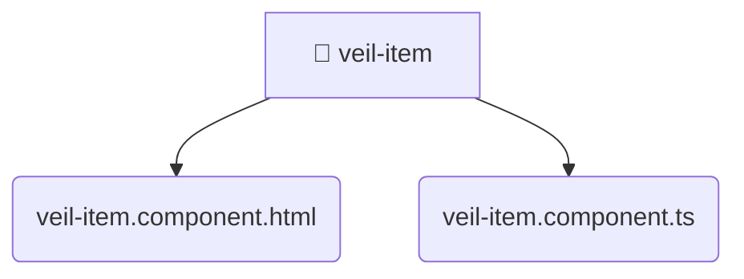

# [root](/) / [frontend](/frontend) / [src](/frontend/src) / [pages](/frontend/src/pages) / [veil](/frontend/src/pages/veil) / [ui](/frontend/src/pages/veil/ui) / [veil-item](/frontend/src/pages/veil/ui/veil-item)

## 🏷️ 📁 Veil-item (Page Layer)

### 🎯 PURPOSE
The `veil-item` page component orchestrates the UI layer for the veil-item feature in the Mavluda Beauty frontend application.

### 🏗️ ARCHITECTURE


### 📄 FILE REGISTRY
| File Name | Type | Responsibility | Key Aliases Used |
|---|---|---|---|
| `veil-item.component.html` | `html` | UI template and styling. | None |
| `veil-item.component.ts` | `ts` | UI component logic and rendering. | @angular, @features |

### 🔗 DEPENDENCIES
- `@angular/common`
- `@angular/core`
- `@features/veil`

### 🛠️ USAGE
```typescript
// Seamlessly integrate veil-item into your refined workflows:
import { /* exported members */ } from '@path/to/veil-item';
```
