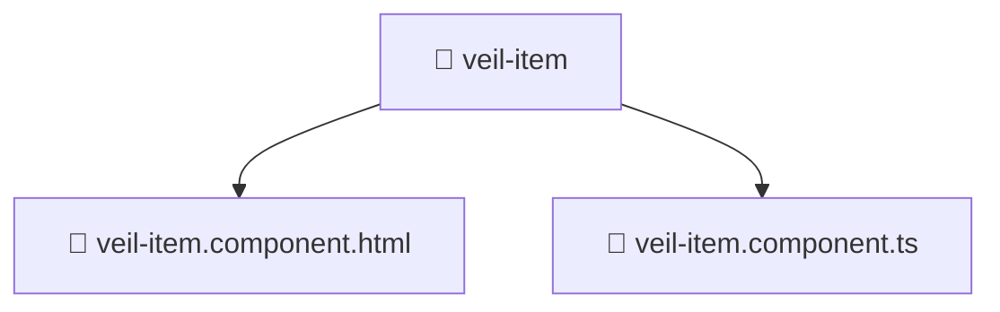

# 📁 Mavluda Beauty veil-item

[frontend](/frontend) / [src](/frontend/src) / [pages](/frontend/src/pages) / [veil](/frontend/src/pages/veil) / [ui](/frontend/src/pages/veil/ui) / [veil-item](/frontend/src/pages/veil/ui/veil-item)

## 🎯 Purpose
Delivering luxury-tier architectural components and high-performance logic for the **veil-item** domain. This directory is a crucial part of the Mavluda Beauty full-stack ecosystem, ensuring seamless scalability, robust performance, and an elite digital experience.

> **FSD Layer**: `Pages` - Adhering to Feature Sliced Design principles.

## 🏗️ Architecture


## 📄 File Registry
| File Name | Type | Responsibility | Key Aliases Used |
|---|---|---|---|
| `veil-item.component.html` | Component | Renders UI and handles user interaction. | N/A |
| `veil-item.component.ts` | Component | Renders UI and handles user interaction. | `@angular/core, @angular/common, @features/veil` |


## 🔗 Dependencies
**Path Aliases:**
- `@angular/core`
- `@angular/common`
- `@features/veil`


## 🛠️ Usage
```typescript
// Example integration for veil-item
// Import capabilities from this directory to enrich your modules.
```
> This directory provides specialized logic tailored to the Mavluda Beauty standard.
