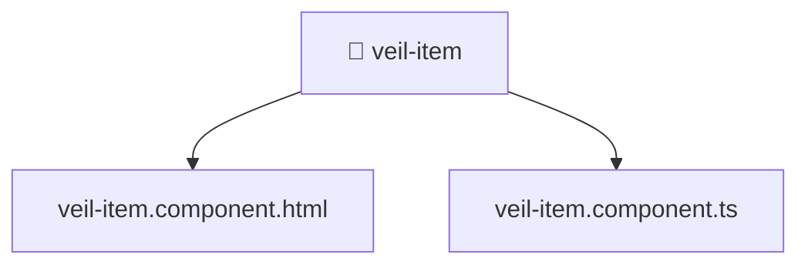

[🏠 Home](../../../../../../README.md) > [frontend](../../../../../README.md) > [src](../../../../README.md) > [pages](../../../README.md) > [veil](../../README.md) > [ui](../README.md) > [veil-item](./README.md)

# 📁 veil-item

**FSD Layer:** `Pages`

### 🎯 PURPOSE
Welcome to the exquisite **veil-item** module of the Mavluda Beauty ecosystem. This directory focuses on orchestrating UI Components. It is designed adhering to our 'Luxury Professional' standards.

### 🏗️ ARCHITECTURE


### 📄 FILE REGISTRY
| File Name | Type | Responsibility | Key Aliases Used |
|---|---|---|---|
| `veil-item.component.html` | HTML Template | Provides logic and definitions for veil-item.component.html. | None |
| `veil-item.component.ts` | Angular Component | Defines a UI component and its logic Defines classes: VeilItemComponent. | @features, @angular |

### 🔗 DEPENDENCIES
- `@angular/common`
- `@angular/core`
- `@features/veil`

### 🛠️ USAGE
```typescript
// Example interaction or integration snippet
// Import members from veil-item based on module boundaries
```
