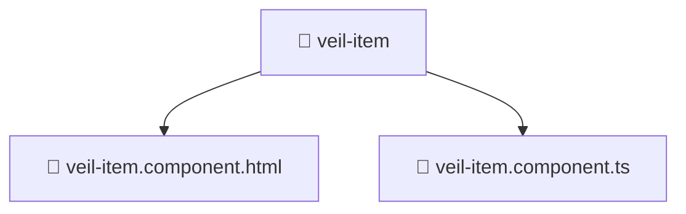

### 🧭 Breadcrumbs
[Root](/) > [frontend](/frontend) > [src](/frontend/src) > [pages](/frontend/src/pages) > [veil](/frontend/src/pages/veil) > [ui](/frontend/src/pages/veil/ui) > [veil-item](/frontend/src/pages/veil/ui/veil-item)

# 📁 Veil-item Directory
**Architecture Layer:** Page Layer

## 🎯 Purpose
Provides luxury professional architectural implementation for the veil-item module within the Mavluda Beauty ecosystem. Ensure robust functionality and elegant integration with the broader architecture.

## 🏗️ ARCHITECTURE


## 📄 FILE REGISTRY
| File Name | Type | Responsibility | Key Aliases Used |
|---|---|---|---|
| `veil-item.component.html` | HTML Template | Structural template and layout for veil-item.component.html. | N/A |
| `veil-item.component.ts` | TypeScript | UI component logic and state management for veil-item.component.ts. | @angular/core, @features/veil, @angular/common |

## 🔗 DEPENDENCIES
- `@angular/common`
- `@angular/core`
- `@features/veil`

## 🛠️ USAGE
```typescript
// Example architectural integration for veil-item
// Utilize the exported members according to Mavluda Beauty's standard conventions.
```

---
*Maintained by Mavluda Beauty - Architecture & Engineering*

---
*Maintained by Mavluda Beauty - Architecture & Engineering*