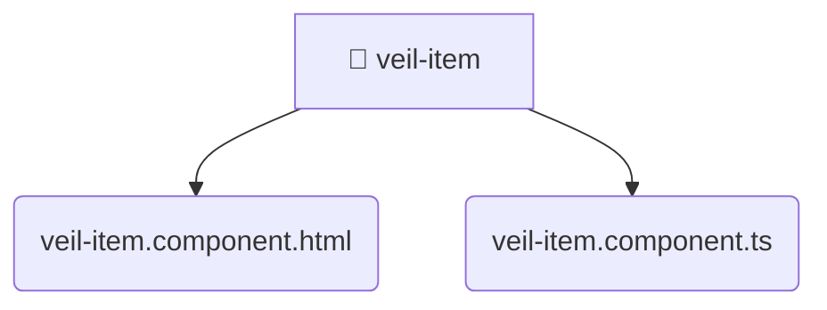

# [frontend](/frontend) / [src](/frontend/src) / [pages](/frontend/src/pages) / [veil](/frontend/src/pages/veil) / [ui](/frontend/src/pages/veil/ui) / [veil-item](/frontend/src/pages/veil/ui/veil-item)

## 🏷️ 📁 Veil-item

### 🎯 PURPOSE
The `veil-item` directory forms a critical foundation within the Mavluda Beauty ecosystem, meticulously orchestrating the veil-item logic to ensure a seamless and premium experience. Integrated within our cutting-edge Angular frontend architecture, it crafts an elegant, highly-responsive user interface reflecting our luxury brand standards. This module is a distinguished component of the **Pages** layer under the Feature Sliced Design (FSD) methodology.

### 🏗️ ARCHITECTURE


### 📄 FILE REGISTRY
| File Name | Type | Responsibility | Key Aliases Used |
|---|---|---|---|
| `veil-item.component.html` | `html` | Encapsulates premium logic and definitions for `veil-item.component.html`. | None |
| `veil-item.component.ts` | `ts` | Encapsulates premium logic and definitions for `veil-item.component.ts`. | @angular/core, @features/veil, @angular/common |


### 🔗 DEPENDENCIES
- `@angular/common`
- `@angular/core`
- `@features/veil`

### 🛠️ USAGE
```typescript
// Seamlessly integrate veil-item into your refined workflows:
import { /* exported members */ } from '@path/to/veil-item';
```
