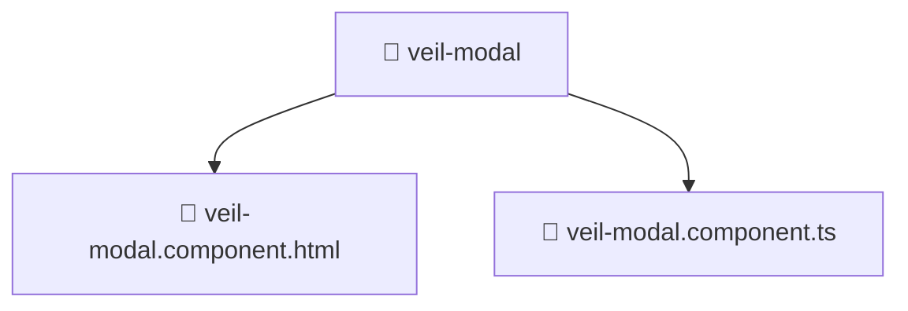

# 📁 veil-modal

[Root](/.) > [frontend](/frontend) > [src](/frontend/src) > [pages](/frontend/src/pages) > [veil](/frontend/src/pages/veil) > [ui](/frontend/src/pages/veil/ui) > [veil-modal](/frontend/src/pages/veil/ui/veil-modal)

**FSD Layer:** Page

## 🎯 Purpose
Frontend UI components containing template structures, styling, and specific behavioral logic.

## 🏗️ Architecture


## 📄 File Registry
| File Name | Type | Responsibility | Key Aliases Used |
|---|---|---|---|
| `veil-modal.component.html` | Template | Structural template and layout for veil-modal.component.html. | N/A |
| `veil-modal.component.ts` | TypeScript | UI component logic and state management for veil-modal.component.ts. | @angular, @features |

## 🔗 Dependencies
- `@angular/common`
- `@angular/forms`
- `@features/veil`

## 🛠️ Usage
```html
<!-- Example usage in a parent component template -->
<app-component-selector></app-component-selector>
```
