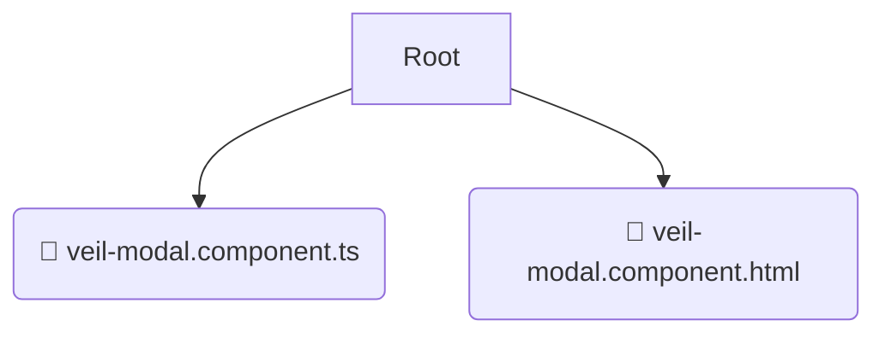

# 📂 veil-modal

*Breadcrumbs:* [frontend](/frontend) / [src](/frontend/src) / [pages](/frontend/src/pages) / [veil](/frontend/src/pages/veil) / [ui](/frontend/src/pages/veil/ui) / [veil-modal](/frontend/src/pages/veil/ui/veil-modal)

## 🎯 PURPOSE
This directory `veil-modal` is an integral part of the Mavluda Beauty ecosystem. (FSD Layer: Pages) It composes features and widgets into routable page views.
This directory is meticulously maintained to uphold the 'Luxury Professional' standards of the Mavluda Beauty brand.

## 🏗️ ARCHITECTURE


## 📄 FILE REGISTRY
| File Name | Type | Responsibility | Key Aliases Used |
|---|---|---|---|
| `veil-modal.component.ts` | `ts` | UI Component logic | `@angular/forms, @angular/core, @angular/common...` |
| `veil-modal.component.html` | `html` | UI Template | `None` |

## 🔗 DEPENDENCIES
- `@angular/forms`
- `@angular/core`
- `@angular/common`
- `@features/veil`

## 🛠️ USAGE
```typescript
// Example placeholder for interacting with the veil-modal module
import { example } from './veil-modal.component.ts';
```
