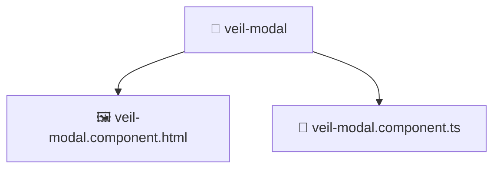

# 📁 veil-modal

[Root](/../../../../../../README.md) / [frontend](../../../../../README.md) / [src](../../../../README.md) / [pages](../../../README.md) / [veil](../../README.md) / [ui](../README.md) / [veil-modal](./README.md)

## 🎯 Purpose
Delivering luxury-tier architectural components and high-performance logic for the **veil-modal** domain. This directory is a crucial part of the Mavluda Beauty full-stack ecosystem, ensuring seamless scalability, robust performance, and an elite digital experience.

**FSD Layer:** Pages

## 🏗️ Architecture


## 📄 File Registry
| File Name | Type | Responsibility | Key Aliases Used |
|---|---|---|---|
| `veil-modal.component.html` | Template | Structural template and layout for veil-modal.component.html. | N/A |
| `veil-modal.component.ts` | Component | UI component logic and state management for veil-modal.component.ts. | @angular, @features |


## 🔗 Dependencies
**Internal / Aliases:**
- `@angular/common`
- `@angular/forms`
- `@features/veil`


## 🛠️ Usage
```typescript
// Example usage within the Mavluda Beauty ecosystem
import { relevantMember } from './veil-modal.component';

// Integrate into the application architecture
relevantMember.execute();
```
