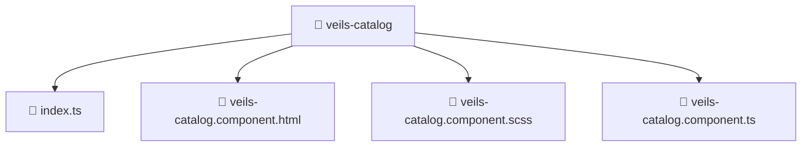

[Root](/.) > [frontend](/frontend) > [src](/frontend/src) > [pages](/frontend/src/pages) > [veils-catalog](/frontend/src/pages/veils-catalog)

# 📁 Veils-catalog (Pages Layer)

## 🎯 Purpose
Delivering luxury-tier architectural components and high-performance logic for the **veils-catalog** domain. This directory is a crucial part of the Mavluda Beauty full-stack ecosystem, ensuring seamless scalability, robust performance, and an elite digital experience.
This directory operates within the **Pages Layer** of the Feature Sliced Design (FSD) architecture.

## 🏗️ Architecture


## 📄 File Registry
| File Name | Type | Responsibility | Key Aliases Used |
|---|---|---|---|
| `index.ts` | TypeScript | Provides core logic and orchestration for index.ts. | N/A |
| `veils-catalog.component.html` | HTML | Structural template and layout for veils-catalog.component.html. | N/A |
| `veils-catalog.component.scss` | CSS/SCSS | Luxury styling and visual presentation for veils-catalog.component.scss. | N/A |
| `veils-catalog.component.ts` | TypeScript | UI component logic and state management for veils-catalog.component.ts. | @angular, @entities, @environments, @shared |

## 🔗 Dependencies
- `./veils-catalog.component`, `@angular/common`, `@angular/core`, `@entities/admin-settings`, `@entities/veil`, `@environments/environment`, `@shared/lib`, `@shared/ui`

## 🛠️ Usage
```typescript
// Example usage within the Mavluda Beauty ecosystem
import { relevantMember } from './core';

// Integrate into the application architecture
relevantMember.execute();
```