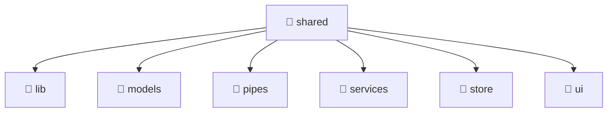

# [root](/) / [frontend](/frontend) / [src](/frontend/src) / [shared](/frontend/src/shared)

## 🏷️ 📁 Shared

### 🎯 PURPOSE
The `shared` directory forms a critical foundation within the Mavluda Beauty ecosystem, meticulously orchestrating the shared logic to ensure a seamless and premium experience.

This directory resides within the **Shared** layer of our Feature Sliced Design (FSD) architecture, strictly adhering to Mavluda Beauty's robust separation of concerns.

### 🏗️ ARCHITECTURE


### 📄 FILE REGISTRY
| File Name | Type | Responsibility | Key Aliases Used |
|---|---|---|---|
| *No files* | `-` | *Directory is strictly structural.* | `-` |

### 🔗 DEPENDENCIES
- *Self-contained premium module.*

### 🛠️ USAGE
```typescript
// Seamlessly integrate shared into your refined workflows:
import { /* exported members */ } from '@path/to/shared';
```
