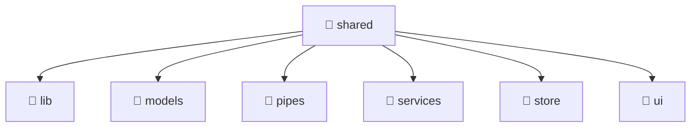

# [root](/) / [frontend](/frontend) / [src](/frontend/src) / [shared](/frontend/src/shared)

## 🏷️ 📁 Shared (Shared Layer)

### 🎯 PURPOSE
The `shared` shared module provides reusable UI components and utilities across the frontend.

### 🏗️ ARCHITECTURE


### 📄 FILE REGISTRY
| File Name | Type | Responsibility | Key Aliases Used |
|---|---|---|---|
| (No files) | - | - | - |

### 🔗 DEPENDENCIES
- `None`

### 🛠️ USAGE
```typescript
// Seamlessly integrate shared into your refined workflows:
import { /* exported members */ } from '@path/to/shared';
```
