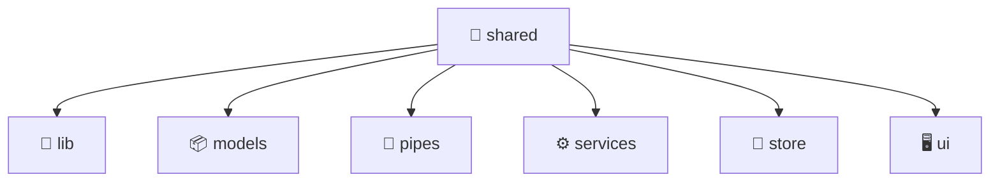

# [frontend](/frontend) / [src](/frontend/src) / [shared](/frontend/src/shared)

## 🏷️ 🤝 Shared

### 🎯 PURPOSE
The `shared` directory forms a critical foundation within the Mavluda Beauty ecosystem, meticulously orchestrating the shared logic to ensure a seamless and premium experience. Integrated within our cutting-edge Angular frontend architecture, it crafts an elegant, highly-responsive user interface reflecting our luxury brand standards. This module is a distinguished component of the **Shared** layer under the Feature Sliced Design (FSD) methodology.

### 🏗️ ARCHITECTURE


### 📄 FILE REGISTRY
| File Name | Type | Responsibility | Key Aliases Used |
|---|---|---|---|
| *No exclusive files* | - | Architecturally reserved | - |


### 🔗 DEPENDENCIES
- *Self-contained premium module.*

### 🛠️ USAGE
```typescript
// Seamlessly integrate shared into your refined workflows:
import { /* exported members */ } from '@path/to/shared';
```
