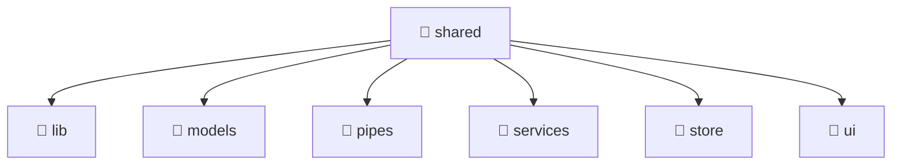

# 📁 Shared Directory

[Root](/.) / [frontend](/frontend) / [src](/frontend/src) / [shared](/frontend/src/shared)

## 🎯 Purpose
Delivering luxury-tier architectural components and high-performance logic for the **shared** domain. This directory is a crucial part of the Mavluda Beauty full-stack ecosystem, ensuring seamless scalability, robust performance, and an elite digital experience.
**FSD Layer:** Shared


## 🏗️ Architecture


## 📄 File Registry
| File Name | Type | Responsibility | Key Aliases Used |
|---|---|---|---|
| `lib` | Directory | Contains architectural sub-modules and layer logic for lib. | N/A |
| `models` | Directory | Contains architectural sub-modules and layer logic for models. | N/A |
| `pipes` | Directory | Contains architectural sub-modules and layer logic for pipes. | N/A |
| `services` | Directory | Contains architectural sub-modules and layer logic for services. | N/A |
| `store` | Directory | Contains architectural sub-modules and layer logic for store. | N/A |
| `ui` | Directory | Contains architectural sub-modules and layer logic for ui. | N/A |

## 🔗 Dependencies
- Relies on internal Mavluda Beauty architecture and designated FSD layers.
- See 'Key Aliases Used' in the File Registry for explicit cross-domain references.

## 🛠️ Usage
```typescript
// Example usage within the Mavluda Beauty ecosystem
import { relevantMember } from './core';

// Integrate into the application architecture
relevantMember.execute();
```
