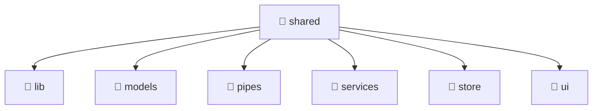

# 📁 shared

[Root](/.) > [frontend](/frontend) > [src](/frontend/src) > [shared](/frontend/src/shared)

**FSD Layer:** Shared

## 🎯 Purpose
Delivering luxury-tier architectural components and logic for the **shared** domain. Ensuring seamless scalability, robust performance, and an elite digital experience in the Mavluda Beauty ecosystem.

## 🏗️ Architecture

## 📄 File Registry
| File Name | Type | Responsibility | Key Aliases Used |
|---|---|---|---|

## 🔗 Dependencies
- No external dependencies.

## 🛠️ Usage
> No specific code execution examples for this directory.
