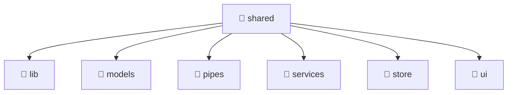

<!--
Mavluda Beauty - Luxury Professional Documentation
Generated for 100% Architectural Transparency
-->
[Home](../../../README.md) > [frontend](../../README.md) > [src](../README.md) > [shared](./README.md)

# 🤝 SHARED Directory

> **FSD Layer:** Shared

## 🎯 PURPOSE
Contains shared reusable UI components, utilities, and services across the entire application.

## 🏗️ ARCHITECTURE


## 📄 FILE REGISTRY
| File Name | Type | Responsibility | Key Aliases Used |
|---|---|---|---|
| (No files) | - | - | - |


## 🔗 DEPENDENCIES
- No external or internal imports detected in this directory.

## 🛠️ USAGE
```typescript
// Example placeholder for interacting with shared
// Consult the individual files in the registry for specific APIs.
```
