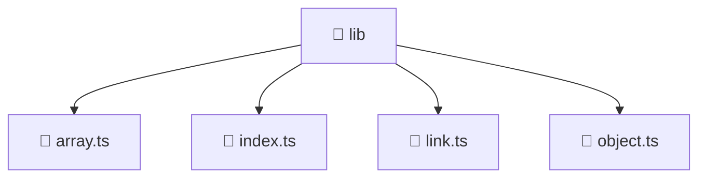

# 📁 lib

[Root](/.) > [frontend](/frontend) > [src](/frontend/src) > [shared](/frontend/src/shared) > [lib](/frontend/src/shared/lib)

## 🎯 Purpose
Delivering luxury-tier architectural components and high-performance logic for the **lib** domain. This directory is a crucial part of the Mavluda Beauty full-stack ecosystem, ensuring seamless scalability, robust performance, and an elite digital experience.

## 🏗️ Architecture


## 📄 File Registry
| File Name | Type | Responsibility | Key Aliases Used |
|---|---|---|---|
| `array.ts` | TypeScript | Handles logic and definitions for array.ts | None |
| `index.ts` | TypeScript | Handles logic and definitions for index.ts | None |
| `link.ts` | TypeScript | Handles logic and definitions for link.ts | @environments/environment |
| `object.ts` | TypeScript | Handles logic and definitions for object.ts | None |

## 🔗 Dependencies
- `@environments/environment`

## 🛠️ Usage
```typescript
// Example usage within the Mavluda Beauty ecosystem
import { relevantMember } from './lib';

// Integrate into the application architecture
relevantMember.execute();
```
