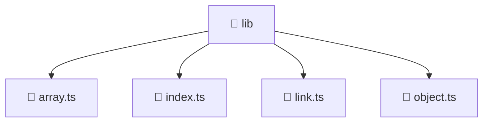

# 📁 lib

[Root](/../../../../README.md) / [frontend](../../../README.md) / [src](../../README.md) / [shared](../README.md) / [lib](./README.md)

## 🎯 Purpose
Delivering luxury-tier architectural components and high-performance logic for the **lib** domain. This directory is a crucial part of the Mavluda Beauty full-stack ecosystem, ensuring seamless scalability, robust performance, and an elite digital experience.

**FSD Layer:** Shared

## 🏗️ Architecture


## 📄 File Registry
| File Name | Type | Responsibility | Key Aliases Used |
|---|---|---|---|
| `array.ts` | TypeScript | Provides core logic and orchestration for array.ts. | N/A |
| `index.ts` | TypeScript | Provides core logic and orchestration for index.ts. | N/A |
| `link.ts` | TypeScript | Provides core logic and orchestration for link.ts. | @environments |
| `object.ts` | TypeScript | Provides core logic and orchestration for object.ts. | N/A |


## 🔗 Dependencies
**Internal / Aliases:**
- `@environments/environment`


## 🛠️ Usage
```typescript
// Example usage within the Mavluda Beauty ecosystem
import { relevantMember } from './array';

// Integrate into the application architecture
relevantMember.execute();
```
