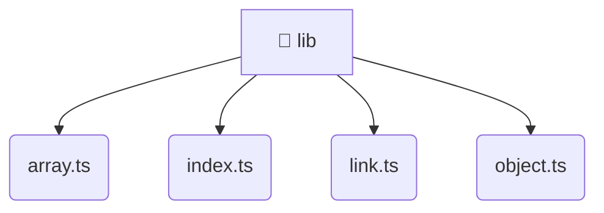

# [root](/) / [frontend](/frontend) / [src](/frontend/src) / [shared](/frontend/src/shared) / [lib](/frontend/src/shared/lib)

## 🏷️ 📁 Lib (Shared Layer)

### 🎯 PURPOSE
The `lib` shared module provides reusable UI components and utilities across the frontend.

### 🏗️ ARCHITECTURE


### 📄 FILE REGISTRY
| File Name | Type | Responsibility | Key Aliases Used |
|---|---|---|---|
| `array.ts` | `ts` | Core logic implementation. | None |
| `index.ts` | `ts` | Core logic implementation. | None |
| `link.ts` | `ts` | Core logic implementation. | @environments |
| `object.ts` | `ts` | Core logic implementation. | None |

### 🔗 DEPENDENCIES
- `./array`
- `./link`
- `./object`
- `@environments/environment`

### 🛠️ USAGE
```typescript
// Seamlessly integrate lib into your refined workflows:
import { /* exported members */ } from '@path/to/lib';
```
