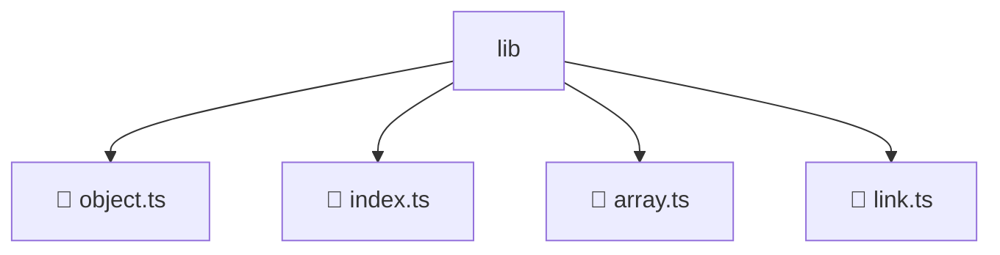

# 📂 LIB

> 💎 **Mavluda Beauty - Luxury Professional Architecture**

### 📍 Breadcrumb Navigation
`. > frontend > src > shared > lib`

## 🎯 PURPOSE
This directory encapsulates `Shared` level functionality within the Mavluda Beauty ecosystem, ensuring proper separation of concerns and architectural transparency.

**FSD / Architecture Layer:** `Shared`

## 🏗️ ARCHITECTURE


## 📄 FILE REGISTRY

| Item Name | Type | Responsibility | Key Aliases Used |
|-----------|------|----------------|------------------|
| `📄 object.ts` | `.ts` | General functionality | `None` |
| `📄 index.ts` | `.ts` | General functionality | `None` |
| `📄 array.ts` | `.ts` | General functionality | `None` |
| `📄 link.ts` | `.ts` | General functionality | `@environments/environment` |

## 🔗 DEPENDENCIES
- `@environments/environment`

## 🛠️ USAGE
```typescript
// Example usage context
import { ... } from './object';

// Integrate object logic into your feature.
```
