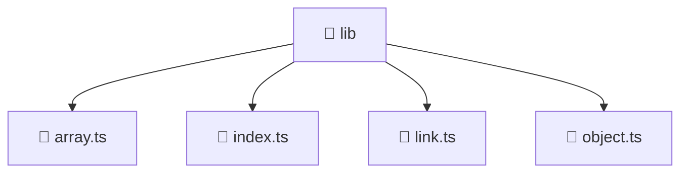

### 🧭 Breadcrumbs
[Root](/) > [frontend](/frontend) > [src](/frontend/src) > [shared](/frontend/src/shared) > [lib](/frontend/src/shared/lib)

# 📁 Lib Directory
**Architecture Layer:** Shared Layer

## 🎯 Purpose
Provides luxury professional architectural implementation for the lib module within the Mavluda Beauty ecosystem. Ensure robust functionality and elegant integration with the broader architecture.

## 🏗️ ARCHITECTURE


## 📄 FILE REGISTRY
| File Name | Type | Responsibility | Key Aliases Used |
|---|---|---|---|
| `array.ts` | TypeScript | Provides core logic and orchestration for array.ts. | N/A |
| `index.ts` | TypeScript | Provides core logic and orchestration for index.ts. | N/A |
| `link.ts` | TypeScript | Provides core logic and orchestration for link.ts. | @environments/environment |
| `object.ts` | TypeScript | Provides core logic and orchestration for object.ts. | N/A |

## 🔗 DEPENDENCIES
- `@environments/environment`

## 🛠️ USAGE
```typescript
// Example architectural integration for lib
// Utilize the exported members according to Mavluda Beauty's standard conventions.
```

---
*Maintained by Mavluda Beauty - Architecture & Engineering*

---
*Maintained by Mavluda Beauty - Architecture & Engineering*