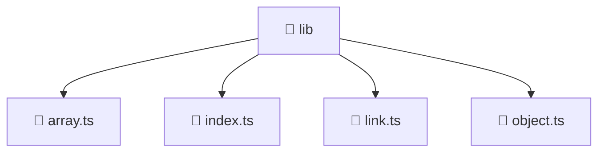

<!--
Mavluda Beauty - Luxury Professional Documentation
Generated for 100% Architectural Transparency
-->
[Home](../../../../README.md) > [frontend](../../../README.md) > [src](../../README.md) > [shared](../README.md) > [lib](./README.md)

# 📁 LIB Directory

> **FSD Layer:** Shared

## 🎯 PURPOSE
Contains shared reusable UI components, utilities, and services across the entire application.

## 🏗️ ARCHITECTURE


## 📄 FILE REGISTRY
| File Name | Type | Responsibility | Key Aliases Used |
|---|---|---|---|
| `array.ts` | TypeScript | Core logic implementation. | - |
| `index.ts` | TypeScript | Core logic implementation. | - |
| `link.ts` | TypeScript | Core logic implementation. | @environments |
| `object.ts` | TypeScript | Core logic implementation. | - |


## 🔗 DEPENDENCIES
- `@environments/environment`

## 🛠️ USAGE
```typescript
// Example placeholder for interacting with lib
// Consult the individual files in the registry for specific APIs.
```
