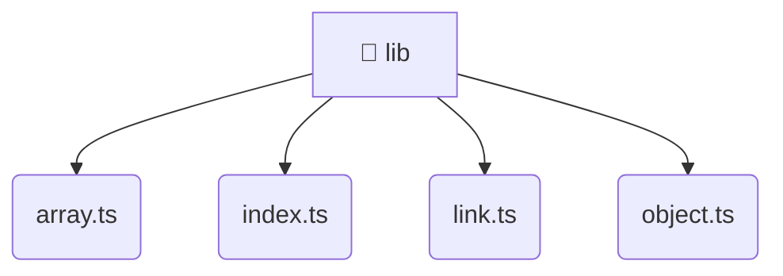

# [frontend](/frontend) / [src](/frontend/src) / [shared](/frontend/src/shared) / [lib](/frontend/src/shared/lib)

## 🏷️ 📁 Lib

### 🎯 PURPOSE
The `lib` directory forms a critical foundation within the Mavluda Beauty ecosystem, meticulously orchestrating the lib logic to ensure a seamless and premium experience. Integrated within our cutting-edge Angular frontend architecture, it crafts an elegant, highly-responsive user interface reflecting our luxury brand standards. This module is a distinguished component of the **Shared** layer under the Feature Sliced Design (FSD) methodology.

### 🏗️ ARCHITECTURE


### 📄 FILE REGISTRY
| File Name | Type | Responsibility | Key Aliases Used |
|---|---|---|---|
| `array.ts` | `ts` | Encapsulates premium logic and definitions for `array.ts`. | None |
| `index.ts` | `ts` | Encapsulates premium logic and definitions for `index.ts`. | None |
| `link.ts` | `ts` | Encapsulates premium logic and definitions for `link.ts`. | @environments/environment |
| `object.ts` | `ts` | Encapsulates premium logic and definitions for `object.ts`. | None |


### 🔗 DEPENDENCIES
- `@environments/environment`

### 🛠️ USAGE
```typescript
// Seamlessly integrate lib into your refined workflows:
import { /* exported members */ } from '@path/to/lib';
```
