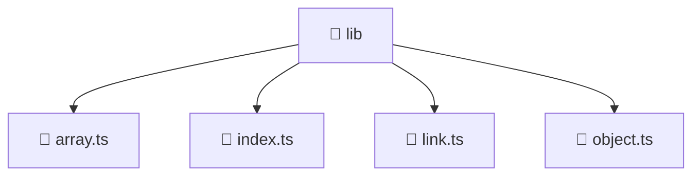

# 📁 lib

[Root](/.) > [frontend](/frontend) > [src](/frontend/src) > [shared](/frontend/src/shared) > [lib](/frontend/src/shared/lib)

**FSD Layer:** Shared

## 🎯 Purpose
Shared utility functions, helpers, and common logic applicable across multiple modules.

## 🏗️ Architecture


## 📄 File Registry
| File Name | Type | Responsibility | Key Aliases Used |
|---|---|---|---|
| `array.ts` | TypeScript | Provides core logic and orchestration for array.ts. | N/A |
| `index.ts` | TypeScript | Provides core logic and orchestration for index.ts. | N/A |
| `link.ts` | TypeScript | Provides core logic and orchestration for link.ts. | @environments |
| `object.ts` | TypeScript | Provides core logic and orchestration for object.ts. | N/A |

## 🔗 Dependencies
- `@environments/environment`

## 🛠️ Usage
```typescript
import { specificUtility } from './utils';
const result = specificUtility(input);
```
