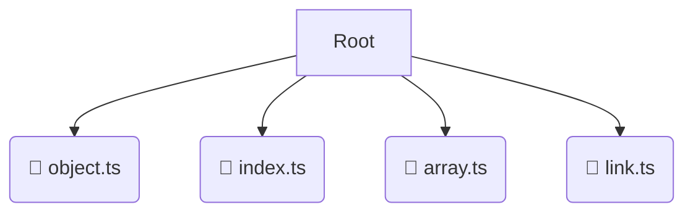

# 📂 lib

*Breadcrumbs:* [frontend](/frontend) / [src](/frontend/src) / [shared](/frontend/src/shared) / [lib](/frontend/src/shared/lib)

## 🎯 PURPOSE
This directory `lib` is an integral part of the Mavluda Beauty ecosystem. (FSD Layer: Shared) It provides reusable utilities, UI components, and infrastructure agnostic of business logic.
This directory is meticulously maintained to uphold the 'Luxury Professional' standards of the Mavluda Beauty brand.

## 🏗️ ARCHITECTURE


## 📄 FILE REGISTRY
| File Name | Type | Responsibility | Key Aliases Used |
|---|---|---|---|
| `object.ts` | `ts` | Core functionality | `None` |
| `index.ts` | `ts` | Core functionality | `None` |
| `array.ts` | `ts` | Core functionality | `None` |
| `link.ts` | `ts` | Core functionality | `@environments/environment` |

## 🔗 DEPENDENCIES
- `@environments/environment`

## 🛠️ USAGE
```typescript
// Example placeholder for interacting with the lib module
import { example } from './object.ts';
```
