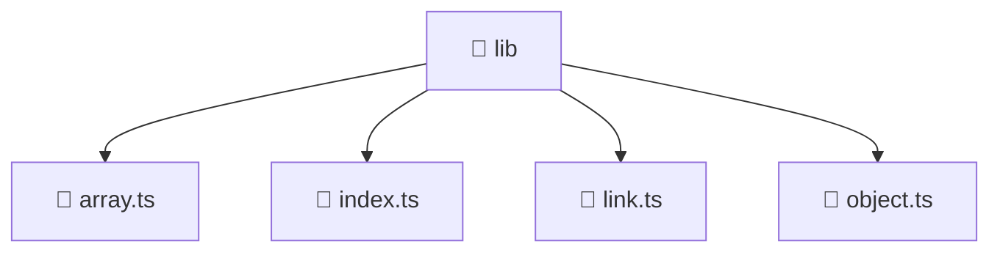

# 📁 lib

[Root](/.) > [frontend](/frontend) > [src](/frontend/src) > [shared](/frontend/src/shared) > [lib](/frontend/src/shared/lib)

## 🎯 Purpose
Delivering luxury-tier architectural components and high-performance logic for the **lib** domain. This directory is a crucial part of the Mavluda Beauty full-stack ecosystem, ensuring seamless scalability, robust performance, and an elite digital experience.
> **FSD Layer:** Shared - Adhering to strict Feature Sliced Design architectural constraints.

## 🏗️ Architecture


## 📄 File Registry
| File Name | Type | Responsibility | Key Aliases Used |
|---|---|---|---|
| `array.ts` | File | Core logic and utilities for this domain. | N/A |
| `index.ts` | File | Core logic and utilities for this domain. | N/A |
| `link.ts` | File | Core logic and utilities for this domain. | @environments |
| `object.ts` | File | Core logic and utilities for this domain. | N/A |


## 🔗 Dependencies
- `./link`
- `./object`
- `./array`
- `@environments/environment`

## 🛠️ Usage
```typescript
// Example usage within the Mavluda Beauty ecosystem
import { relevantMember } from './array';

// Integrate into the application architecture
relevantMember.execute();
```
