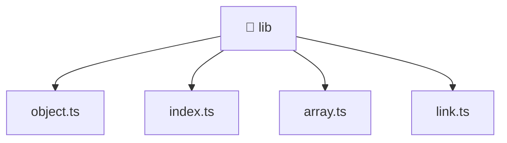

[🏠 Home](../../../../README.md) > [frontend](../../../README.md) > [src](../../README.md) > [shared](../README.md) > [lib](./README.md)

# 📁 lib

**FSD Layer:** `Shared`

### 🎯 PURPOSE
Welcome to the exquisite **lib** module of the Mavluda Beauty ecosystem. This directory handles specific domain assets and logic. It is designed adhering to our 'Luxury Professional' standards.

### 🏗️ ARCHITECTURE


### 📄 FILE REGISTRY
| File Name | Type | Responsibility | Key Aliases Used |
|---|---|---|---|
| `array.ts` | TypeScript File | Implements utilities: deleteArrayItemById. | None |
| `index.ts` | TypeScript File | Exports or orchestrates module members. | None |
| `link.ts` | TypeScript File | Implements utilities: linkCombine, linkServerConvert. | @environments |
| `object.ts` | TypeScript File | Implements utilities: objectExcludePropety, formDataExcludeProperty, convertFormData. | None |

### 🔗 DEPENDENCIES
- `@environments/environment`

### 🛠️ USAGE
```typescript
// Example interaction or integration snippet
import { utility } from '@shared/path';
```
