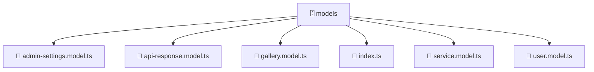

# 🗄️ Mavluda Beauty models

[frontend](/frontend) / [src](/frontend/src) / [shared](/frontend/src/shared) / [models](/frontend/src/shared/models)

## 🎯 Purpose
Delivering luxury-tier architectural components and high-performance logic for the **models** domain. This directory is a crucial part of the Mavluda Beauty full-stack ecosystem, ensuring seamless scalability, robust performance, and an elite digital experience.

> **FSD Layer**: `Shared` - Adhering to Feature Sliced Design principles.

## 🏗️ Architecture


## 📄 File Registry
| File Name | Type | Responsibility | Key Aliases Used |
|---|---|---|---|
| `admin-settings.model.ts` | TypeScript Logic | Core logic and utilities for this domain. | N/A |
| `api-response.model.ts` | TypeScript Logic | Core logic and utilities for this domain. | N/A |
| `gallery.model.ts` | TypeScript Logic | Core logic and utilities for this domain. | N/A |
| `index.ts` | TypeScript Logic | Core logic and utilities for this domain. | N/A |
| `service.model.ts` | TypeScript Logic | Core logic and utilities for this domain. | N/A |
| `user.model.ts` | TypeScript Logic | Core logic and utilities for this domain. | N/A |


## 🔗 Dependencies
No external or alias dependencies detected.

## 🛠️ Usage
```typescript
// Example integration for models
// Import capabilities from this directory to enrich your modules.
```
> This directory provides specialized logic tailored to the Mavluda Beauty standard.
