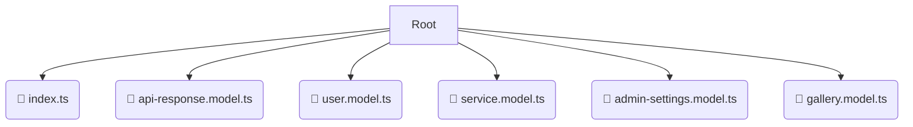

# 📂 models

*Breadcrumbs:* [frontend](/frontend) / [src](/frontend/src) / [shared](/frontend/src/shared) / [models](/frontend/src/shared/models)

## 🎯 PURPOSE
This directory `models` is an integral part of the Mavluda Beauty ecosystem. (FSD Layer: Shared) It provides reusable utilities, UI components, and infrastructure agnostic of business logic.
This directory is meticulously maintained to uphold the 'Luxury Professional' standards of the Mavluda Beauty brand.

## 🏗️ ARCHITECTURE


## 📄 FILE REGISTRY
| File Name | Type | Responsibility | Key Aliases Used |
|---|---|---|---|
| `index.ts` | `ts` | Core functionality | `None` |
| `api-response.model.ts` | `ts` | Core functionality | `None` |
| `user.model.ts` | `ts` | Core functionality | `None` |
| `service.model.ts` | `ts` | Core functionality | `None` |
| `admin-settings.model.ts` | `ts` | Core functionality | `None` |
| `gallery.model.ts` | `ts` | Core functionality | `None` |

## 🔗 DEPENDENCIES
- No significant internal/external dependencies found.

## 🛠️ USAGE
```typescript
// Example placeholder for interacting with the models module
import { example } from './index.ts';
```
