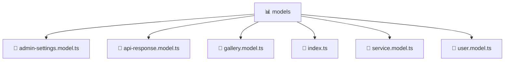

# 📊 models

[Root](/.) > [frontend](/frontend) > [src](/frontend/src) > [shared](/frontend/src/shared) > [models](/frontend/src/shared/models)

## 🎯 Purpose
Delivering luxury-tier architectural components and high-performance logic for the **models** domain. This directory is a crucial part of the Mavluda Beauty full-stack ecosystem, ensuring seamless scalability, robust performance, and an elite digital experience.
> **FSD Layer:** Shared - Adhering to strict Feature Sliced Design architectural constraints.

## 🏗️ Architecture


## 📄 File Registry
| File Name | Type | Responsibility | Key Aliases Used |
|---|---|---|---|
| `admin-settings.model.ts` | File | Core logic and utilities for this domain. | N/A |
| `api-response.model.ts` | File | Core logic and utilities for this domain. | N/A |
| `gallery.model.ts` | File | Core logic and utilities for this domain. | N/A |
| `index.ts` | File | Core logic and utilities for this domain. | N/A |
| `service.model.ts` | File | Core logic and utilities for this domain. | N/A |
| `user.model.ts` | File | Core logic and utilities for this domain. | N/A |


## 🔗 Dependencies
- `./admin-settings.model`
- `./api-response.model`
- `./gallery.model`
- `./service.model`
- `./user.model`

## 🛠️ Usage
```typescript
// Example usage within the Mavluda Beauty ecosystem
import { relevantMember } from './admin-settings.model';

// Integrate into the application architecture
relevantMember.execute();
```
