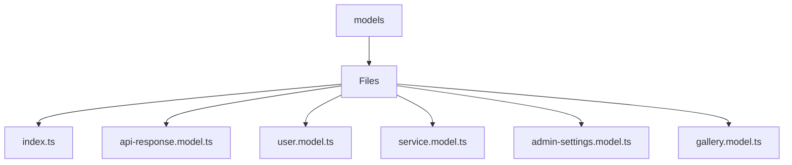

# 🏷️ Models Directory

> *Elegance, Precision, and Luxury Professionalism — The Mavluda Beauty Standard.*

## 🧭 Breadcrumb Navigation
[frontend](/frontend) ➔ [src](/frontend/src) ➔ [shared](/frontend/src/shared) ➔ [models](/frontend/src/shared/models)

## 🎯 Purpose
This directory encapsulates the essential architecture and logic for the **Models** domain within the Mavluda Beauty ecosystem. It serves as a foundational component ensuring robust, scalable, and elegant operations.

**Feature Sliced Design (FSD) Layer:** `Shared`

## 🏗️ Architecture


## 📄 File Registry
| File Name | Type | Responsibility | Key Aliases Used |
|---|---|---|---|
| `index.ts` | TypeScript | Defines logic and structure for index.ts. | None |
| `api-response.model.ts` | TypeScript | Exports: ApiResponse | None |
| `user.model.ts` | TypeScript | Exports: User | None |
| `service.model.ts` | TypeScript | Exports: Service | None |
| `admin-settings.model.ts` | TypeScript | Exports: AdminLocation, OwnerInfo, AdminSettings | None |
| `gallery.model.ts` | TypeScript | Exports: ImageStatus, ImageCategory, Gallery | None |

## 🔗 Dependencies
No external or cross-module dependencies detected.

## 🛠️ Usage
```typescript
// To utilize the luxurious capabilities of this module:
import { ApiResponse } from './path/to/apiresponse';

// Ensure properly typed interactions per Mavluda Beauty standards
```
