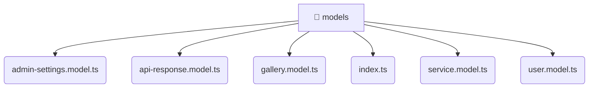

# [root](/) / [frontend](/frontend) / [src](/frontend/src) / [shared](/frontend/src/shared) / [models](/frontend/src/shared/models)

## 🏷️ 📁 Models (Shared Layer)

### 🎯 PURPOSE
The `models` shared module provides reusable UI components and utilities across the frontend.

### 🏗️ ARCHITECTURE


### 📄 FILE REGISTRY
| File Name | Type | Responsibility | Key Aliases Used |
|---|---|---|---|
| `admin-settings.model.ts` | `ts` | Data transfer objects and models. | None |
| `api-response.model.ts` | `ts` | Data transfer objects and models. | None |
| `gallery.model.ts` | `ts` | Data transfer objects and models. | None |
| `index.ts` | `ts` | Core logic implementation. | None |
| `service.model.ts` | `ts` | Data transfer objects and models. | None |
| `user.model.ts` | `ts` | Data transfer objects and models. | None |

### 🔗 DEPENDENCIES
- `./admin-settings.model`
- `./api-response.model`
- `./gallery.model`
- `./service.model`
- `./user.model`

### 🛠️ USAGE
```typescript
// Seamlessly integrate models into your refined workflows:
import { /* exported members */ } from '@path/to/models';
```
