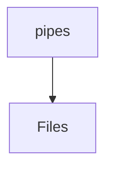

# 📁 Pipes Directory

[frontend](/frontend) > [src](/frontend/src) > [shared](/frontend/src/shared) > [pipes](/frontend/src/shared/pipes)

## 🎯 Purpose
A high-level module handling `pipes` logic within the Mavluda Beauty ecosystem. This directory adheres to our "Luxury Professional" architectural standards.

**FSD Layer:** Shared


## 🏗️ Architecture



## 📄 File Registry
| File Name | Type | Responsibility | Key Aliases Used |
|-----------|------|----------------|------------------|
| `index.ts` | TypeScript | Provides localized typescript definitions. | None |
| `safe-html.pipe.ts` | TypeScript | Provides localized typescript definitions. | @angular/core, @angular/platform-browser |

## 🔗 Dependencies
- `@angular/core`
- `@angular/platform-browser`

## 🛠️ Usage
```typescript
// Architectural overview snippet
import { InternalLogic } from './internal-file';
// Ensure adherence to Hexagonal / FSD principles
```
