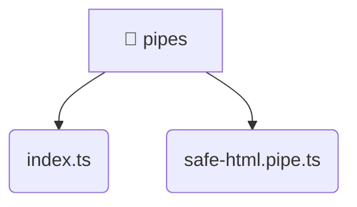

# [root](/) / [frontend](/frontend) / [src](/frontend/src) / [shared](/frontend/src/shared) / [pipes](/frontend/src/shared/pipes)

## 🏷️ 📁 Pipes (Shared Layer)

### 🎯 PURPOSE
The `pipes` shared module provides reusable UI components and utilities across the frontend.

### 🏗️ ARCHITECTURE


### 📄 FILE REGISTRY
| File Name | Type | Responsibility | Key Aliases Used |
|---|---|---|---|
| `index.ts` | `ts` | Core logic implementation. | None |
| `safe-html.pipe.ts` | `ts` | Core logic implementation. | @angular |

### 🔗 DEPENDENCIES
- `./safe-html.pipe`
- `@angular/core`
- `@angular/platform-browser`

### 🛠️ USAGE
```typescript
// Seamlessly integrate pipes into your refined workflows:
import { /* exported members */ } from '@path/to/pipes';
```
