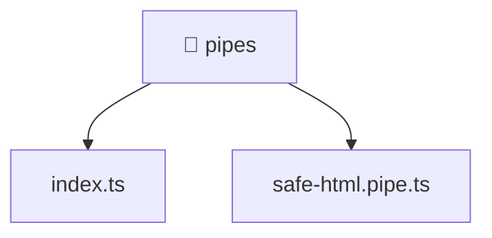

[🏠 Home](../../../../README.md) > [frontend](../../../README.md) > [src](../../README.md) > [shared](../README.md) > [pipes](./README.md)

# 📁 pipes

**FSD Layer:** `Shared`

### 🎯 PURPOSE
Welcome to the exquisite **pipes** module of the Mavluda Beauty ecosystem. This directory handles specific domain assets and logic. It is designed adhering to our 'Luxury Professional' standards.

### 🏗️ ARCHITECTURE


### 📄 FILE REGISTRY
| File Name | Type | Responsibility | Key Aliases Used |
|---|---|---|---|
| `index.ts` | TypeScript File | Exports or orchestrates module members. | None |
| `safe-html.pipe.ts` | Angular Pipe | Defines classes: SafeHtmlPipe. | @angular |

### 🔗 DEPENDENCIES
- `@angular/core`
- `@angular/platform-browser`

### 🛠️ USAGE
```typescript
// Example interaction or integration snippet
import { utility } from '@shared/path';
```
