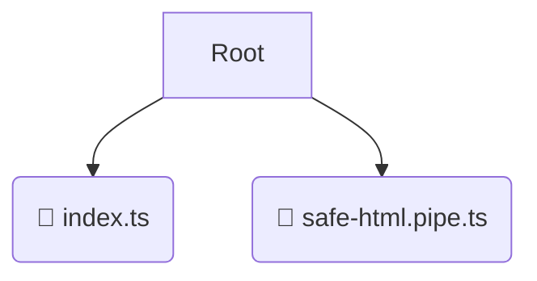

# 📂 pipes

*Breadcrumbs:* [frontend](/frontend) / [src](/frontend/src) / [shared](/frontend/src/shared) / [pipes](/frontend/src/shared/pipes)

## 🎯 PURPOSE
This directory `pipes` is an integral part of the Mavluda Beauty ecosystem. (FSD Layer: Shared) It provides reusable utilities, UI components, and infrastructure agnostic of business logic.
This directory is meticulously maintained to uphold the 'Luxury Professional' standards of the Mavluda Beauty brand.

## 🏗️ ARCHITECTURE


## 📄 FILE REGISTRY
| File Name | Type | Responsibility | Key Aliases Used |
|---|---|---|---|
| `index.ts` | `ts` | Core functionality | `None` |
| `safe-html.pipe.ts` | `ts` | Core functionality | `@angular/core, @angular/platform-browser` |

## 🔗 DEPENDENCIES
- `@angular/core`
- `@angular/platform-browser`

## 🛠️ USAGE
```typescript
// Example placeholder for interacting with the pipes module
import { example } from './index.ts';
```
