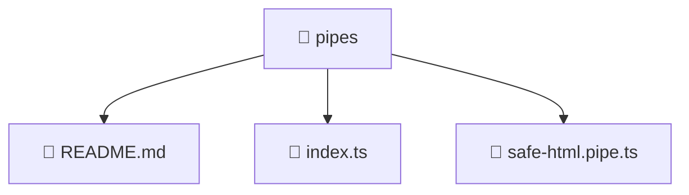

# 📁 pipes

[Root](/.) > [frontend](/frontend) > [src](/frontend/src) > [shared](/frontend/src/shared) > [pipes](/frontend/src/shared/pipes)

## 🎯 Purpose
Delivering luxury-tier architectural components and high-performance logic for the **pipes** domain. This directory is a crucial part of the Mavluda Beauty full-stack ecosystem, ensuring seamless scalability, robust performance, and an elite digital experience.

💎 **FSD Layer:** This directory represents the **Shared** layer in the Feature Sliced Design (FSD) architecture, strictly adhering to its modular principles.

## 🏗️ Architecture


## 📄 File Registry
| File Name | Type | Responsibility | Key Aliases Used |
|---|---|---|---|
| `README.md` | Markdown | Provides core logic and configuration for README.md. | N/A |
| `index.ts` | TypeScript | Provides core logic and orchestration for index.ts. | N/A |
| `safe-html.pipe.ts` | TypeScript | Provides core logic and orchestration for safe-html.pipe.ts. | @angular |

## 🔗 Dependencies
- `./pipes`
- `./safe-html.pipe`
- `@angular/core`
- `@angular/platform-browser`

## 🛠️ Usage
```typescript
// Example usage within the Mavluda Beauty ecosystem
import { relevantMember } from './pipes';

// Integrate into the application architecture
relevantMember.execute();
```
