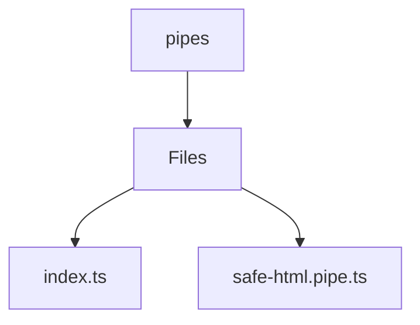

# 🏷️ Pipes Directory

> *Elegance, Precision, and Luxury Professionalism — The Mavluda Beauty Standard.*

## 🧭 Breadcrumb Navigation
[frontend](/frontend) ➔ [src](/frontend/src) ➔ [shared](/frontend/src/shared) ➔ [pipes](/frontend/src/shared/pipes)

## 🎯 Purpose
This directory encapsulates the essential architecture and logic for the **Pipes** domain within the Mavluda Beauty ecosystem. It serves as a foundational component ensuring robust, scalable, and elegant operations.

**Feature Sliced Design (FSD) Layer:** `Shared`

## 🏗️ Architecture


## 📄 File Registry
| File Name | Type | Responsibility | Key Aliases Used |
|---|---|---|---|
| `index.ts` | TypeScript | Defines logic and structure for index.ts. | None |
| `safe-html.pipe.ts` | TypeScript | Exports: SafeHtmlPipe | None |

## 🔗 Dependencies
- `@angular/core`
- `@angular/platform-browser`

## 🛠️ Usage
```typescript
// To utilize the luxurious capabilities of this module:
import { SafeHtmlPipe } from './path/to/safehtmlpipe';

// Ensure properly typed interactions per Mavluda Beauty standards
```
