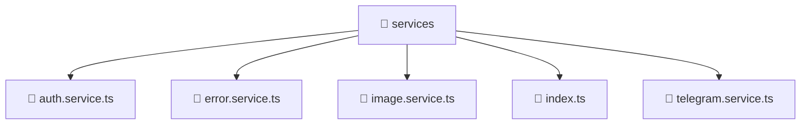

<!--
Mavluda Beauty - Luxury Professional Documentation
Generated for 100% Architectural Transparency
-->
[Home](../../../../README.md) > [frontend](../../../README.md) > [src](../../README.md) > [shared](../README.md) > [services](./README.md)

# 📁 SERVICES Directory

> **FSD Layer:** Shared

## 🎯 PURPOSE
Contains shared reusable UI components, utilities, and services across the entire application.

## 🏗️ ARCHITECTURE


## 📄 FILE REGISTRY
| File Name | Type | Responsibility | Key Aliases Used |
|---|---|---|---|
| `auth.service.ts` | TypeScript | Business logic and service orchestration. | @angular, @core, @shared |
| `error.service.ts` | TypeScript | Business logic and service orchestration. | @angular |
| `image.service.ts` | TypeScript | Business logic and service orchestration. | @angular |
| `index.ts` | TypeScript | Core logic implementation. | - |
| `telegram.service.ts` | TypeScript | Business logic and service orchestration. | @angular, @src |


## 🔗 DEPENDENCIES
- `@angular/common/http`
- `@angular/core`
- `@angular/router`
- `@core/constants`
- `@shared/models`
- `rxjs`
- `./telegram.service`
- `@src/types/telegram`

## 🛠️ USAGE
```typescript
// Example placeholder for interacting with services
// Consult the individual files in the registry for specific APIs.
```
