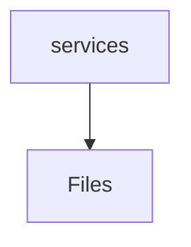

# 📁 Services Directory

[frontend](/frontend) > [src](/frontend/src) > [shared](/frontend/src/shared) > [services](/frontend/src/shared/services)

## 🎯 Purpose
A high-level module handling `services` logic within the Mavluda Beauty ecosystem. This directory adheres to our "Luxury Professional" architectural standards.

**FSD Layer:** Shared


## 🏗️ Architecture



## 📄 File Registry
| File Name | Type | Responsibility | Key Aliases Used |
|-----------|------|----------------|------------------|
| `auth.service.ts` | Service | Executes core business logic and use cases. | @angular/core, @angular/router, @shared/models, @core/constants, @angular/common/http |
| `error.service.ts` | Service | Executes core business logic and use cases. | @angular/core |
| `image.service.ts` | Service | Executes core business logic and use cases. | @angular/core |
| `index.ts` | TypeScript | Provides localized typescript definitions. | None |
| `telegram.service.ts` | Service | Executes core business logic and use cases. | @angular/core, @src/types/telegram |

## 🔗 Dependencies
- `@angular/common/http`
- `@angular/core`
- `@angular/router`
- `@core/constants`
- `@shared/models`
- `@src/types/telegram`

## 🛠️ Usage
```typescript
// Architectural overview snippet
import { InternalLogic } from './internal-file';
// Ensure adherence to Hexagonal / FSD principles
```
