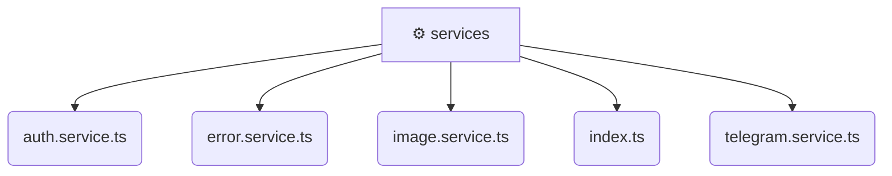

# [frontend](/frontend) / [src](/frontend/src) / [shared](/frontend/src/shared) / [services](/frontend/src/shared/services)

## 🏷️ ⚙️ Services

### 🎯 PURPOSE
The `services` directory forms a critical foundation within the Mavluda Beauty ecosystem, meticulously orchestrating the services logic to ensure a seamless and premium experience. Integrated within our cutting-edge Angular frontend architecture, it crafts an elegant, highly-responsive user interface reflecting our luxury brand standards. This module is a distinguished component of the **Shared** layer under the Feature Sliced Design (FSD) methodology.

### 🏗️ ARCHITECTURE


### 📄 FILE REGISTRY
| File Name | Type | Responsibility | Key Aliases Used |
|---|---|---|---|
| `auth.service.ts` | `ts` | Encapsulates premium logic and definitions for `auth.service.ts`. | @shared/models, @angular/core, @core/constants, @angular/common/http, @angular/router |
| `error.service.ts` | `ts` | Encapsulates premium logic and definitions for `error.service.ts`. | @angular/core |
| `image.service.ts` | `ts` | Encapsulates premium logic and definitions for `image.service.ts`. | @angular/core |
| `index.ts` | `ts` | Encapsulates premium logic and definitions for `index.ts`. | None |
| `telegram.service.ts` | `ts` | Encapsulates premium logic and definitions for `telegram.service.ts`. | @src/types/telegram, @angular/core |


### 🔗 DEPENDENCIES
- `@angular/common/http`
- `@angular/core`
- `@angular/router`
- `@core/constants`
- `@shared/models`
- `@src/types/telegram`

### 🛠️ USAGE
```typescript
// Seamlessly integrate services into your refined workflows:
import { /* exported members */ } from '@path/to/services';
```
