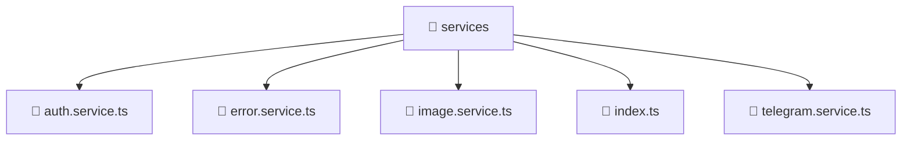

# 📁 services

[Root](/.) > [frontend](/frontend) > [src](/frontend/src) > [shared](/frontend/src/shared) > [services](/frontend/src/shared/services)

**FSD Layer:** Shared

## 🎯 Purpose
Data access and service layer handling communication with external APIs or databases.

## 🏗️ Architecture


## 📄 File Registry
| File Name | Type | Responsibility | Key Aliases Used |
|---|---|---|---|
| `auth.service.ts` | TypeScript | Encapsulates business logic and data access for auth.service.ts. | @angular, @core, @shared |
| `error.service.ts` | TypeScript | Encapsulates business logic and data access for error.service.ts. | @angular |
| `image.service.ts` | TypeScript | Encapsulates business logic and data access for image.service.ts. | @angular |
| `index.ts` | TypeScript | Provides core logic and orchestration for index.ts. | N/A |
| `telegram.service.ts` | TypeScript | Encapsulates business logic and data access for telegram.service.ts. | @angular, @src |

## 🔗 Dependencies
- `./telegram.service`
- `@angular/common/http`
- `@angular/core`
- `@angular/router`
- `@core/constants`
- `@shared/models`
- `@src/types/telegram`
- `rxjs`

## 🛠️ Usage
```typescript
// Inject the service into your component/controller
constructor(private readonly service: SpecificService) {}
```
