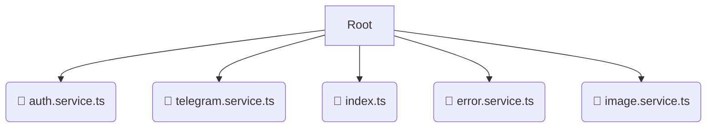

# 💼 services

*Breadcrumbs:* [frontend](/frontend) / [src](/frontend/src) / [shared](/frontend/src/shared) / [services](/frontend/src/shared/services)

## 🎯 PURPOSE
This directory `services` is an integral part of the Mavluda Beauty ecosystem. (FSD Layer: Shared) It provides reusable utilities, UI components, and infrastructure agnostic of business logic.
This directory is meticulously maintained to uphold the 'Luxury Professional' standards of the Mavluda Beauty brand.

## 🏗️ ARCHITECTURE


## 📄 FILE REGISTRY
| File Name | Type | Responsibility | Key Aliases Used |
|---|---|---|---|
| `auth.service.ts` | `ts` | Core functionality | `@angular/router, @angular/common/http, @core/constants...` |
| `telegram.service.ts` | `ts` | Core functionality | `@angular/core, @src/types/telegram` |
| `index.ts` | `ts` | Core functionality | `None` |
| `error.service.ts` | `ts` | Core functionality | `@angular/core` |
| `image.service.ts` | `ts` | Core functionality | `@angular/core` |

## 🔗 DEPENDENCIES
- `@angular/router`
- `@angular/common/http`
- `@core/constants`
- `@src/types/telegram`
- `@angular/core`
- `@shared/models`

## 🛠️ USAGE
```typescript
// Example placeholder for interacting with the services module
import { example } from './auth.service.ts';
```
