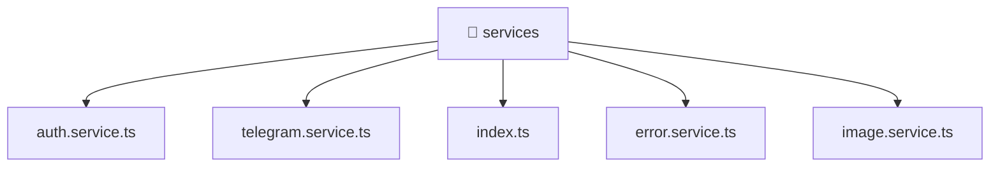

[🏠 Home](../../../../README.md) > [frontend](../../../README.md) > [src](../../README.md) > [shared](../README.md) > [services](./README.md)

# 📁 services

**FSD Layer:** `Shared`

### 🎯 PURPOSE
Welcome to the exquisite **services** module of the Mavluda Beauty ecosystem. This directory focuses on orchestrating Business Services. It is designed adhering to our 'Luxury Professional' standards.

### 🏗️ ARCHITECTURE


### 📄 FILE REGISTRY
| File Name | Type | Responsibility | Key Aliases Used |
|---|---|---|---|
| `auth.service.ts` | Angular Service | Provides injectable business logic or services Defines classes: AuthService. | @angular, @core, @shared |
| `error.service.ts` | Angular Service | Provides injectable business logic or services Defines classes: ErrorService. | @angular |
| `image.service.ts` | Angular Service | Provides injectable business logic or services Defines classes: ImageService. | @angular |
| `index.ts` | TypeScript File | Exports or orchestrates module members. | None |
| `telegram.service.ts` | Angular Service | Provides injectable business logic or services Defines classes: TelegramService. | @src, @angular |

### 🔗 DEPENDENCIES
- `@angular/common/http`
- `@angular/core`
- `@angular/router`
- `@core/constants`
- `@shared/models`
- `@src/types/telegram`
- `rxjs`

### 🛠️ USAGE
```typescript
// Example interaction or integration snippet
import { utility } from '@shared/path';
```
