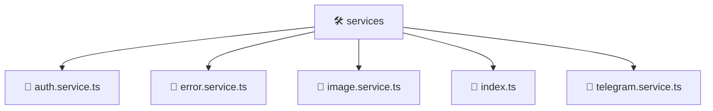

# 🛠️ services

[Root](/.) > [frontend](/frontend) > [src](/frontend/src) > [shared](/frontend/src/shared) > [services](/frontend/src/shared/services)

## 🎯 Purpose
Delivering luxury-tier architectural components and high-performance logic for the **services** domain. This directory is a crucial part of the Mavluda Beauty full-stack ecosystem, ensuring seamless scalability, robust performance, and an elite digital experience.
> **FSD Layer:** Shared - Adhering to strict Feature Sliced Design architectural constraints.

## 🏗️ Architecture


## 📄 File Registry
| File Name | Type | Responsibility | Key Aliases Used |
|---|---|---|---|
| `auth.service.ts` | Service | Business logic and state management. | @angular, @core, @shared |
| `error.service.ts` | Service | Business logic and state management. | @angular |
| `image.service.ts` | Service | Business logic and state management. | @angular |
| `index.ts` | File | Core logic and utilities for this domain. | N/A |
| `telegram.service.ts` | Service | Business logic and state management. | @angular, @src |


## 🔗 Dependencies
- `@angular/common/http`
- `@angular/core`
- `@angular/router`
- `@core/constants`
- `@shared/models`
- `rxjs`
- `./telegram.service`
- `./auth.service`
- `./error.service`
- `./image.service`
- `@src/types/telegram`

## 🛠️ Usage
```typescript
// Example usage within the Mavluda Beauty ecosystem
import { relevantMember } from './auth.service';

// Integrate into the application architecture
relevantMember.execute();
```
