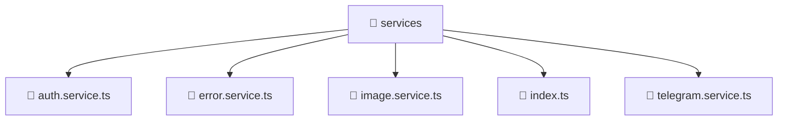

### 🧭 Breadcrumbs
[Root](/) > [frontend](/frontend) > [src](/frontend/src) > [shared](/frontend/src/shared) > [services](/frontend/src/shared/services)

# 📁 Services Directory
**Architecture Layer:** Shared Layer

## 🎯 Purpose
Provides luxury professional architectural implementation for the services module within the Mavluda Beauty ecosystem. Ensure robust functionality and elegant integration with the broader architecture.

## 🏗️ ARCHITECTURE


## 📄 FILE REGISTRY
| File Name | Type | Responsibility | Key Aliases Used |
|---|---|---|---|
| `auth.service.ts` | TypeScript | Encapsulates business logic and data access for auth.service.ts. | @shared/models, @core/constants, @angular/core, @angular/router, @angular/common/http |
| `error.service.ts` | TypeScript | Encapsulates business logic and data access for error.service.ts. | @angular/core |
| `image.service.ts` | TypeScript | Encapsulates business logic and data access for image.service.ts. | @angular/core |
| `index.ts` | TypeScript | Provides core logic and orchestration for index.ts. | N/A |
| `telegram.service.ts` | TypeScript | Encapsulates business logic and data access for telegram.service.ts. | @angular/core, @src/types/telegram |

## 🔗 DEPENDENCIES
- `@angular/common/http`
- `@angular/core`
- `@angular/router`
- `@core/constants`
- `@shared/models`
- `@src/types/telegram`

## 🛠️ USAGE
```typescript
// Example architectural integration for services
// Utilize the exported members according to Mavluda Beauty's standard conventions.
```

---
*Maintained by Mavluda Beauty - Architecture & Engineering*

---
*Maintained by Mavluda Beauty - Architecture & Engineering*