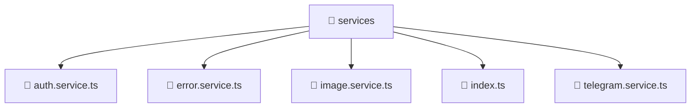

# 📁 services

[Root](/../../../../README.md) / [frontend](../../../README.md) / [src](../../README.md) / [shared](../README.md) / [services](./README.md)

## 🎯 Purpose
Delivering luxury-tier architectural components and high-performance logic for the **services** domain. This directory is a crucial part of the Mavluda Beauty full-stack ecosystem, ensuring seamless scalability, robust performance, and an elite digital experience.

**FSD Layer:** Shared

## 🏗️ Architecture


## 📄 File Registry
| File Name | Type | Responsibility | Key Aliases Used |
|---|---|---|---|
| `auth.service.ts` | Service | Encapsulates business logic and data access for auth.service.ts. | @angular, @core, @shared |
| `error.service.ts` | Service | Encapsulates business logic and data access for error.service.ts. | @angular |
| `image.service.ts` | Service | Encapsulates business logic and data access for image.service.ts. | @angular |
| `index.ts` | TypeScript | Provides core logic and orchestration for index.ts. | N/A |
| `telegram.service.ts` | Service | Encapsulates business logic and data access for telegram.service.ts. | @angular, @src |


## 🔗 Dependencies
**Internal / Aliases:**
- `./telegram.service`
- `@angular/common/http`
- `@angular/core`
- `@angular/router`
- `@core/constants`
- `@shared/models`
- `@src/types/telegram`

**External:**
- `rxjs`


## 🛠️ Usage
```typescript
// Example usage within the Mavluda Beauty ecosystem
import { relevantMember } from './auth.service';

// Integrate into the application architecture
relevantMember.execute();
```
