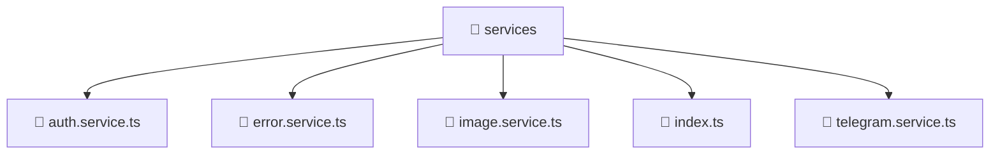

# 📁 services

[Root](/.) > [frontend](/frontend) > [src](/frontend/src) > [shared](/frontend/src/shared) > [services](/frontend/src/shared/services)

**FSD Layer:** Shared

## 🎯 Purpose
Delivering luxury-tier architectural components and high-performance logic for the **Services** domain. This directory is a crucial part of the Mavluda Beauty full-stack ecosystem, ensuring seamless scalability, robust performance, and an elite digital experience.

**Architecture Layer:** Shared (Feature Sliced Design / Layered Architecture)

## 🏗️ Architecture


## 📄 File Registry
| File Name | Type | Responsibility | Key Aliases Used |
|---|---|---|---|
| `auth.service.ts` | TypeScript | Core logic and utilities for this domain. | @angular, @core, @shared |
| `error.service.ts` | TypeScript | Core logic and utilities for this domain. | @angular |
| `image.service.ts` | TypeScript | Core logic and utilities for this domain. | @angular |
| `index.ts` | TypeScript | Core logic and utilities for this domain. | N/A |
| `telegram.service.ts` | TypeScript | Core logic and utilities for this domain. | @angular, @src |

## 🔗 Dependencies
- `./telegram.service`
- `@angular/common/http`
- `@angular/core`
- `@angular/router`
- `@core/constants`
- `@shared/models`
- `@src/types/telegram`
- `rxjs`

## 🛠️ Usage
```markdown
```markdown
> This directory acts primarily as a structural container or logic module.
> To interact with its contents, import the relevant exported members from the `index.ts` or specifically targeted files.
```
```
