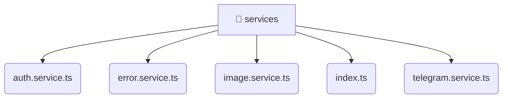

# [root](/) / [frontend](/frontend) / [src](/frontend/src) / [shared](/frontend/src/shared) / [services](/frontend/src/shared/services)

## 🏷️ 📁 Services (Shared Layer)

### 🎯 PURPOSE
The `services` shared module provides reusable UI components and utilities across the frontend.

### 🏗️ ARCHITECTURE


### 📄 FILE REGISTRY
| File Name | Type | Responsibility | Key Aliases Used |
|---|---|---|---|
| `auth.service.ts` | `ts` | Business logic and service layer. | @angular, @core, @shared |
| `error.service.ts` | `ts` | Business logic and service layer. | @angular |
| `image.service.ts` | `ts` | Business logic and service layer. | @angular |
| `index.ts` | `ts` | Core logic implementation. | None |
| `telegram.service.ts` | `ts` | Business logic and service layer. | @angular, @src |

### 🔗 DEPENDENCIES
- `./error.service`
- `./image.service`
- `./telegram.service`
- `@angular/common/http`
- `@angular/core`
- `@angular/router`
- `@core/constants`
- `@shared/models`
- `@src/types/telegram`
- `rxjs`
- `...`

### 🛠️ USAGE
```typescript
// Seamlessly integrate services into your refined workflows:
import { /* exported members */ } from '@path/to/services';
```
