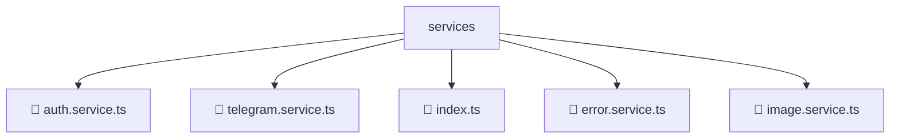

# 📂 SERVICES

> 💎 **Mavluda Beauty - Luxury Professional Architecture**

### 📍 Breadcrumb Navigation
`. > frontend > src > shared > services`

## 🎯 PURPOSE
This directory encapsulates `Shared` level functionality within the Mavluda Beauty ecosystem, ensuring proper separation of concerns and architectural transparency.

**FSD / Architecture Layer:** `Shared`

## 🏗️ ARCHITECTURE


## 📄 FILE REGISTRY

| Item Name | Type | Responsibility | Key Aliases Used |
|-----------|------|----------------|------------------|
| `📄 auth.service.ts` | `.ts` | Service logic | `@core/constants, @angular/core, @shared/models, @angular/router, @angular/common/http` |
| `📄 telegram.service.ts` | `.ts` | Service logic | `@angular/core, @src/types/telegram` |
| `📄 index.ts` | `.ts` | General functionality | `None` |
| `📄 error.service.ts` | `.ts` | Service logic | `@angular/core` |
| `📄 image.service.ts` | `.ts` | Service logic | `@angular/core` |

## 🔗 DEPENDENCIES
- `@core/constants`
- `@angular/core`
- `@shared/models`
- `@angular/router`
- `@src/types/telegram`
- `@angular/common/http`

## 🛠️ USAGE
```typescript
// Example usage context
import { ... } from './auth.service';

// Integrate auth.service logic into your feature.
```
