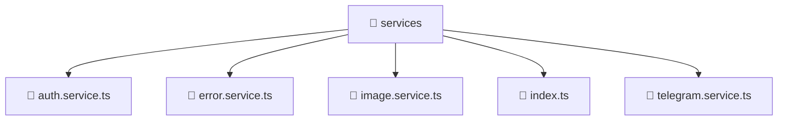

# 📁 services

[Root](/.) > [frontend](/frontend) > [src](/frontend/src) > [shared](/frontend/src/shared) > [services](/frontend/src/shared/services)

## 🎯 Purpose
Delivering luxury-tier architectural components and high-performance logic for the **services** domain. This directory is a crucial part of the Mavluda Beauty full-stack ecosystem, ensuring seamless scalability, robust performance, and an elite digital experience.

## 🏗️ Architecture


## 📄 File Registry
| File Name | Type | Responsibility | Key Aliases Used |
|---|---|---|---|
| `auth.service.ts` | TypeScript | Encapsulates business logic for auth | @angular/common/http, @angular/core, @angular/router, @core/constants, @shared/models |
| `error.service.ts` | TypeScript | Encapsulates business logic for error | @angular/core |
| `image.service.ts` | TypeScript | Encapsulates business logic for image | @angular/core |
| `index.ts` | TypeScript | Handles logic and definitions for index.ts | None |
| `telegram.service.ts` | TypeScript | Encapsulates business logic for telegram | @angular/core, @src/types/telegram |

## 🔗 Dependencies
- `./telegram.service`
- `@angular/common/http`
- `@angular/core`
- `@angular/router`
- `@core/constants`
- `@shared/models`
- `@src/types/telegram`
- `rxjs`

## 🛠️ Usage
```typescript
// Example usage within the Mavluda Beauty ecosystem
import { relevantMember } from './services';

// Integrate into the application architecture
relevantMember.execute();
```
